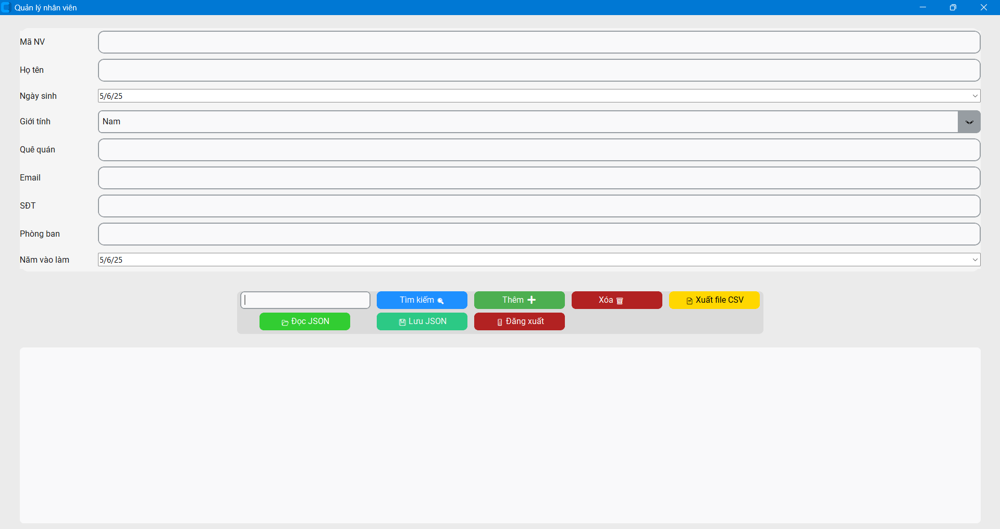
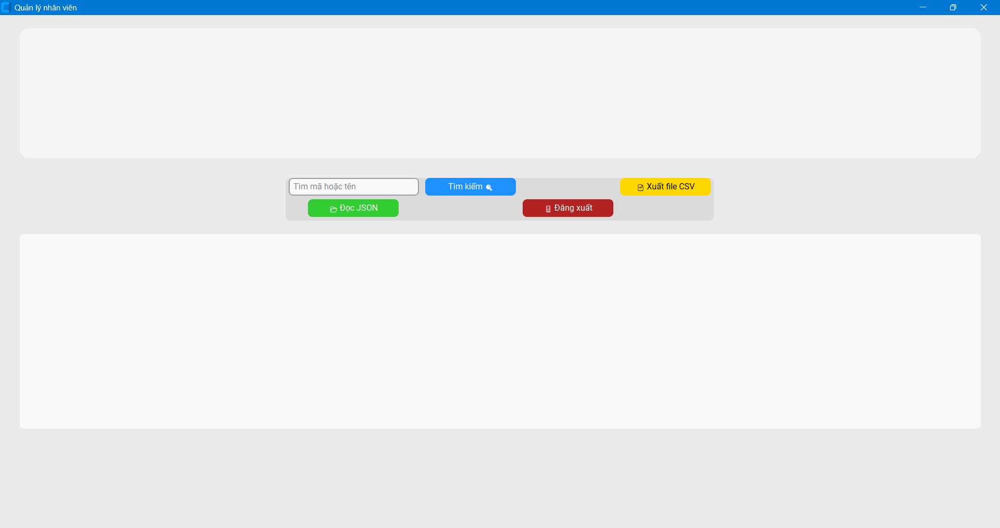

# Employee Management Project

A modern employee management application built with Python and [CustomTkinter](https://github.com/TomSchimansky/CustomTkinter). It supports login functionality, employee management (add/delete/search), data storage in JSON format, and CSV export.

## 💻 Features

- Login with two roles: Admin and Employee
- Animated UI with smooth transitions
- Add, delete, and search employees
- Save employee data to `.json` and export to `.csv`
- Aesthetic interface with background image and loading effects

## 🖼 Interface




## 🚀 Installation

### Requirements:
- Python 3.8 or later
- Windows / macOS / Linux

### Install dependencies:

```bash
pip install -r requirements.txt
```

## 🏃‍♂️ Run the application

```bash
python main.py
```

## 👤 Accounts

- **Admin:** `admin` / `admin`
- **Employee:** `nv` / `123`

## 📁 Project Structure

```
.
├── app.py
├── loginwindow.py
├── main.py
├── nhan_vien.py
├── con_nguoi.py
├── danh_sach_nhan_vien.py
├── nv.png
├── requirements.txt
└── README.md
```

## 📦 Used Packages

- `customtkinter` – Modern UI for Tkinter
- `tkinter` - Original UI
- `tkcalendar` - Input date by calendar
- `Pillow` – Image processing
- `JSON` & `csv` – File Processing

## 📜 License

MIT License.
